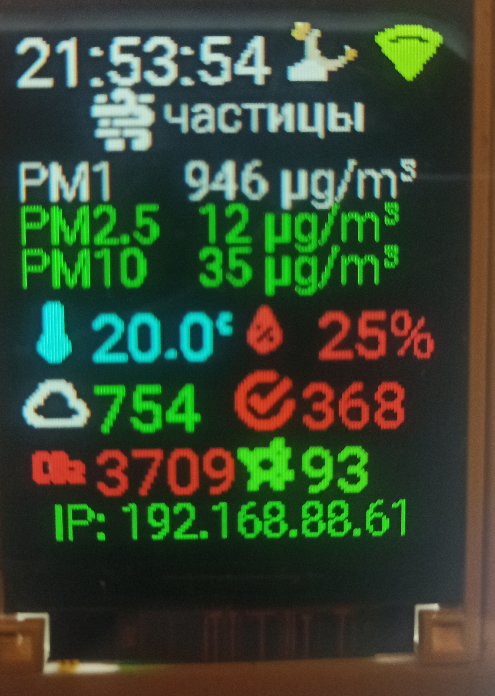
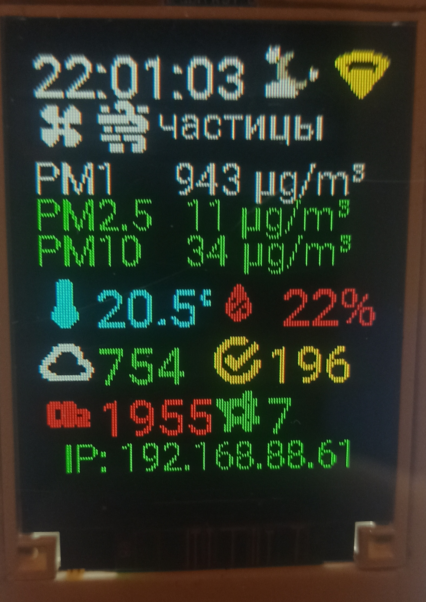
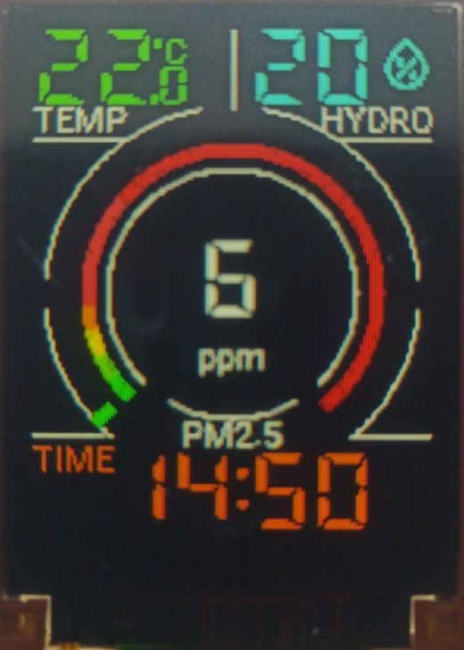

# 🌬️ IKEA Vindriktning — умный монитор качества воздуха

[](https://esphome.io/)
[](https://opensource.org/licenses/MIT)

**Модернизация датчика качества воздуха IKEA Vindriktning** с полной заменой электроники и расширенным функционалом.

---

## 📸 Фотогалерея

| Версия 1 | Версия 2 | Версия 3 |
|----------|----------|----------|
| { width=300 } | { width=300 } | { width=300 } |

---

## 🎯 О проекте

Проект основан на [этой статье](https://modkam.ru/2023/10/30/ikea-vindriktning/) с существенными доработками:

### ✨ Что добавлено/изменено

- 🔄 **Убран родной контроллер** — полный контроль над устройством
- 🌡️ **Добавлен датчик BME680** — температура, влажность, давление, качество воздуха
- 🌀 **Управление вентилятором** — автоматическое или ручное
- 💡 **Регулировка яркости дисплея** — автоматическая или ручная
- 🎨 **Цветовая индикация** — изменение цвета показаний в зависимости от значений
- 🌅 **Индикация солнца** — отображение положения солнца над горизонтом
- 🌤️ **Прогноз погоды** — индикация ожидаемой погоды на основе давления
- 📦 **Компонент PM1006k** — интеграция датчика частиц

**Всё на одной странице дисплея!**

---

## 🛠️ Аппаратная часть

### Используемые компоненты

| Компонент | Назначение |
|-----------|------------|
| **IKEA Vindriktning** | Корпус + датчик PM2.5 |
| **ESP32** | Управление |
| **BME680** | Температура, влажность, давление, VOC |
| **ST7735 TFT** | Цветной дисплей |
| **Шилд TFT I²C** | [Wemos D1 mini shield](https://www.wemos.cc/en/latest/d1_mini_shield/tft_i2c_connector.html) |

---

### 📍 Распайка дисплея ST7735

| Дисплей | ESP32 | Шилд |
|---------|-------|------|
| **SDA** | GPIO23 | D7 |
| **SCLK** | GPIO18 | D5 |
| **D/C** | GPIO5 | D8 |
| **RST** | GPIO1 | RST |
| **CS** | GPIO26 | D0 |
| **LED** | GPIO19 | D6 |

---

### 📍 Распайка контроллера Vindriktning

| Контроллер | ESP32 | Назначение |
|------------|-------|------------|
| **1** | TX | UART передача |
| **2** | GND | Земля |
| **4** | 3.3V | Питание |
| **5** | FAN | Управление вентилятором |
| **8** | RX | UART приём |

---

### 📍 Распайка BME680

| BME680 | Шилд |
|--------|------|
| **GND** | GND |
| **VCC** | 3.3V |
| **SCL** | SCL |
| **SDA** | SDA |

---

## 📂 Конфигурации

| Версия | Файл | Особенности |
|--------|------|-------------|
| **v2** | [`ikea_external_components-v2.yaml`](./ikea_external_components-v2.yaml) | Базовая версия с PM1006k |
| **v3** | [`ikea-circle-new.yaml`](./ikea-circle-new.yaml) | Улучшенный интерфейс |

---

## 🌫️ Интеграция PM1006k

### 🔌 Без родного контроллера

Если датчик PM1006k запускается без родного микроконтроллера, необходимо отправить команду **в течение первых 5 секунд** после подачи питания, иначе датчик переключится в режим PWM.

```yaml
esphome:
  name: "${name}"
  on_boot:
    priority: 240
    then:
      - uart.write:
          id: PM1006k
          data: [0x11, 0x02, 0x0B, 0x01, 0xE1]

uart:
  tx_pin: 3   # 1 ножка контроллера
  rx_pin: 1   # 8 ножка контроллера
  baud_rate: 9600
  id: PM1006k

external_components:
  source: github://ananyevgv/esphome-components
  components: [pm1006k]
  refresh: 0s

sensor:
  - platform: pm1006k
    pm_1_0:   
      name: "PM 1.0"
      id: "pm1"
    pm_2_5:
      name: "PM 2.5"
      id: "pm2"
    pm_10_0:
      name: "PM 10"
      id: "pm10"
    update_interval: 30s
```

### 🔌 С родным контроллером

```yaml
uart:
  rx_pin: 1   # 8 ножка контроллера
  baud_rate: 9600

external_components:
  source: github://ananyevgv/esphome-components
  components: [pm1006k]
  refresh: 0s

sensor:
  - platform: pm1006k
    pm_1_0:   
      name: "PM 1.0"
      id: "pm1"
    pm_2_5:
      name: "PM 2.5"
      id: "pm2"
    pm_10_0:
      name: "PM 10"
      id: "pm10"
```

### 🔧 Возможности
## 🎨 Интерфейс
Цветовая индикация в зависимости от значений:

# 🟢 Зелёный — хорошее качество воздуха

# 🟡 Жёлтый — среднее

# 🔴 Красный — плохое

Прогноз погоды на основе динамики давления

Индикация солнца над горизонтом

### 🌀 Управление
Автоматическое или ручное управление вентилятором

Регулировка яркости дисплея

### 📊 Датчики
PM1.0, PM2.5, PM10 — твёрдые частицы

Температура, влажность, давление (BME680)

Качество воздуха (VOC) — BME680

## ⭐ Поддержать проект

Если проект оказался полезным — поставьте ⭐ на GitHub!
